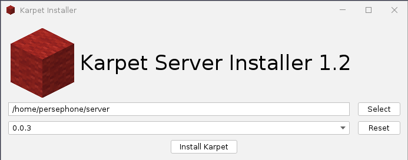

# Karpet Installer
Quickly download, and create a start script for the karpet server

## GUI
The gui is built with Java swing, and the intellij gui designer. It uses flatlaf for the LAF.
It also will look the same on most operating systems.

## OS Support
Linux has only been tested, I dont know about windows. I guess MacOS will work since it is also UNIX like.
